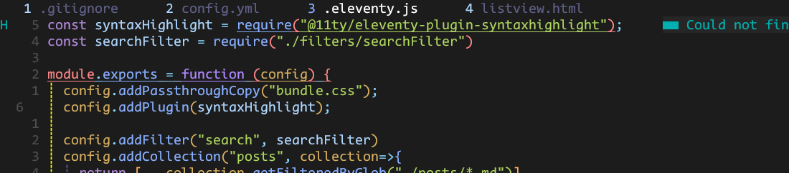
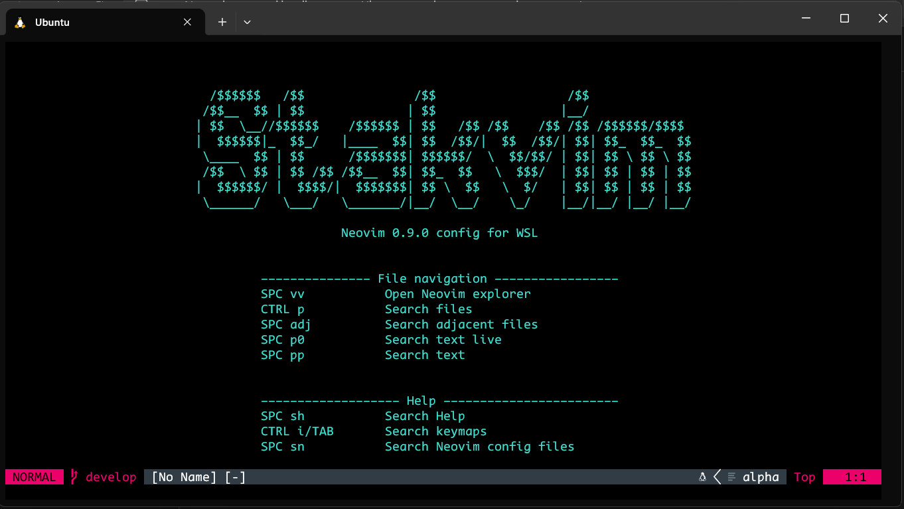
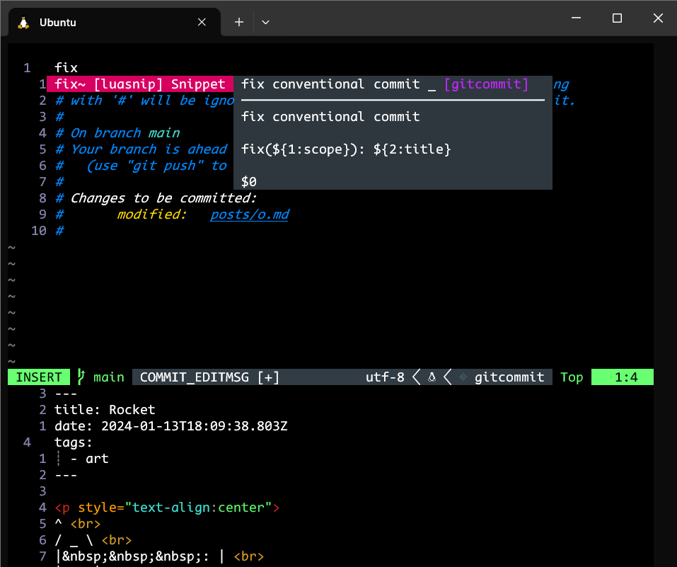

# Pål's Neovim config

## Table of contents

<!-- toc -->

- [Requirements](#requirements)
  * [Semi-requirements / nice to have](#semi-requirements--nice-to-have)
- [Installation](#installation)
  * [Start Neovim](#start-neovim)
- [Usage & utilities](#usage--utilities)
  * [Git](#git)
    + [Source control](#source-control)
      - [Fugitive](#fugitive)
      - [Lazygit.nvim](#lazygitnvim)
  * [Terminal](#terminal)
    + [Exit terminal](#exit-terminal)
    + [Temprorarily jump out of Neovim](#temprorarily-jump-out-of-neovim)
  * [Other tools](#other-tools)
    + [Multiple cursors (Vim visual multi)](#multiple-cursors-vim-visual-multi)
    + [Surround (Nvim surround)](#surround-nvim-surround)
    + [Command preview (live command)](#command-preview-live-command)
  * [Neovim](#neovim)

<!-- tocstop -->

## Requirements

<details>
    <summary><b>WSL</b></summary>

I'm using Ubuntu through WSL on Windows 10 & 11

Yanking to OS clipboard registry is currently customized for WSL specifically (`let g:clipboard = {` from `lazy.lua`). Aside: `:h clipboard-wsl`

---

A note on Windows 11 & its Terminal app:

- `[ctrl] [tab]` is automatically set up to "move to next tab"
- I have _also_ defined a `[ctrl] [tab]` keybinding in the autohotkey file, to "move to previous open tab" (just like hitting `[ctrl] 6` in vim)

If you want to use the latter, you'll have to delete the former. You can open up Terminal settings and delete the "move to next tab".

---
</details>

<details>
    <summary><b>Neovim version 0.9.0</b></summary>

**My Neovim info**
````
NVIM v0.9.0
Build type: Release
LuaJIT 2.1.0-beta3
``````

[How to install Neovim 0.9 in Ubuntu in WSL](docs/neovim-install.md)

---
</details>

<details>
    <summary><b>Git</b></summary>

**How to update git on Ubuntu**

Check `git --version`

Update if necessary

```bash
sudo add-apt-repository ppa:git-core/ppa -y
sudo apt-get update
sudo apt-get install git -y
git --version
```

---
</details>

<details>
    <summary><b>Install Ripgrep for Telescope</b></summary>

Ubuntu

```bash
curl -LO https://github.com/BurntSushi/ripgrep/releases/download/14.1.0/ripgrep_14.1.0-1_amd64.deb
sudo dpkg -i ripgrep_14.1.0-1_amd64.deb
```

Other installation methods: <https://github.com/BurntSushi/ripgrep>

---
</details>

<details>
    <summary><b>Install C compiler for Nvim-treesitter</b></summary>

Ubuntu

```bash
sudo apt install build-essential
```

---
</details>

<details>
    <summary><b>Install nodejs and npm for Lsp-zero (tsserver, html etc.)</b></summary>

Ubuntu

```bash
sudo apt install nodejs npm
```

---
</details>

<br>

### Semi-requirements / nice to have

<details>
    <summary><b>Autohotkey (Windows app, for extra keymaps)</b></summary>

I have made some additional keymaps using Authotkey.

(Some keymaps are too hard / impossible to define in plain Neovim)

**Install AutoHotkey:**

https://www.autohotkey.com/

Download v2.0, launch `AutoHotkey_2.x.x_setup`, accept the default suggestions

**Start script**

Run ahk file

`:lua Ahk()` (might need to source `:so` `autohotkey/init.lua` first)

or

click 'run script' from the right-click menu on the ahk-file

**Stop script**

`Alt+Esc`

---
</details>

<details>
    <summary><b>LazyGit (UI for version control)</b></summary>

Install as explained in <https://github.com/jesseduffield/lazygit#ubuntu>,

run

```bash
LAZYGIT_VERSION=$(curl -s "https://api.github.com/repos/jesseduffield/lazygit/releases/latest" | grep -Po '"tag_name": "v\K[^"]*')
curl -Lo lazygit.tar.gz "https://github.com/jesseduffield/lazygit/releases/latest/download/lazygit_${LAZYGIT_VERSION}_Linux_x86_64.tar.gz"
tar xf lazygit.tar.gz lazygit
sudo install lazygit /usr/local/bin
```

Verify installation

```bash
lazygit --version
```

---
</details>

<details>
    <summary><b>Git delta (Better git diff)</b></summary>

visit: <https://dandavison.github.io/delta/installation.html>

Download the deb for Debian / Ubuntu

| Debian / Ubuntu | `sudo dpkg -i git-delta-musl_x.xx.x_amd64.deb` |
| --------------- | ---------------------------------------------- |

**Usage**

`git diff | delta`

see more

<https://www.youtube.com/watch?v=91p1Fp7Db5c>

---
</details>

<details>
    <summary><b>Tmux (for terminal window management)</b></summary>

Ubuntu or Debian

```bash
apt install tmux
```

Other installation methods: <https://github.com/tmux/tmux/wiki/Installing>

If you want to use this repo's `.tmux.conf`-file as your tmux config

> [!WARNING]
> This Neovim will OVERWRITE your ~/.tmux.conf if you have one

`[space] [space] tmux`

**Install plugin manager**

```bash
git clone https://github.com/tmux-plugins/tpm ~/.tmux/plugins/tpm
```

**Install plugins**

Open tmux, and run:

`[tmux prefix], I`

---
</details>

<details>
    <summary><b>Emmet-ls (node)</b></summary>

1. Install node
2. `npm install -g emmet-ls`
3. for jsx code completion

---
</details>

## Installation 

**Clone config**

> [!WARNING]
> If you already have a `.config/nvim`-directory with important files, make sure to create a backup of them first!

```sh
git clone git@github.com:paalss/nvim.git ~/.config/nvim
```



### Start Neovim

In WSL, navigate to the files you want to edit and run:

```bash
nvim
```

If you get errors, try `:Lazy restore` to use the package versions specified in lazy-lock.json

## Usage & utilities

- View welcome screen and important keybindings: Run `nvim`

### Git

#### Source control 

##### Fugitive

Maps: \
`:h fugitive-maps`

Commit maps: \
`:h fugitive_c`

##### Lazygit.nvim

**Commit using git's default configured editor -> (n)vim**

`C` (uppercase)

**Edit file in new modal:**

`e`

**Open file in default code editor:**

`o`

### Terminal

The 'terminal' here is just a tmux pane -- Neovim terminal plugins such as Toggleterm and FTerm crashed a lot and were a pain to use

Start Neovim inside of tmux

eg.
```
tmux
nvim .
```

---

You can also run `:terminal` and `:autoinsert`, but I haven't tested that as much

#### Exit terminal

Close with `exit` (better yet create an alias for "exit" in your `.bashrc` file. I'm using `alias q="exit"`)

#### Temprorarily jump out of Neovim

Suspend Neovim: `[ctrl] z`

Bring back Neovim: `fg`

### Other tools

#### Multiple cursors (Vim visual multi)

1. Visual mode `v`
2. Enter  visual multi mode `[ctrl] n`

----

#### Surround (Nvim surround)

The primary way of adding a new pair to the buffer is via the normal-mode *ys*
operator, which stands for "you surround". It can be used via
`ys{motion}{char}`, which surrounds a given {motion} with a delimiter pair
associated with {char}. For example, `ysa")` means "you surround around quotes
with parentheses".

**Surround visual selection**

`S` (uppercase)

- `ys` (you surround/add)
- `cs` (change surrounding)
- `ds` (delete surrounding)

**W/o visual selection**

    Old text                    Command         New text
--------------------------------------------------------------------------------
    surr*ound_words             ysiw)           (surround_words)
    *make strings               ys$"            "make strings"
    [delete ar*ound me!]        ds]             delete around me!
    remove <b>HTML t*ags</b>    dst             remove HTML tags
    'change quot*es'            cs'"            "change quotes"
    <b>or tag* types</b>        csth1<CR>       <h1>or tag types</h1>
    delete(functi*on calls)     dsf             function calls

Detailed information on how to use this plugin can be found in :h nvim-surround.usage.

#### Command preview (live command)

<https://github.com/smjonas/live-command.nvim>

Preview norm and macros

- `:Norm` to preview `:norm`
- `:At a` to preview `:norm @a`

### Neovim

**Return to last opened window (buffer)**

`[ctrl] 6`



