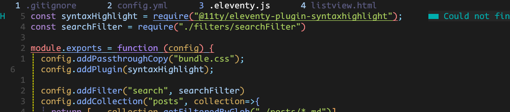
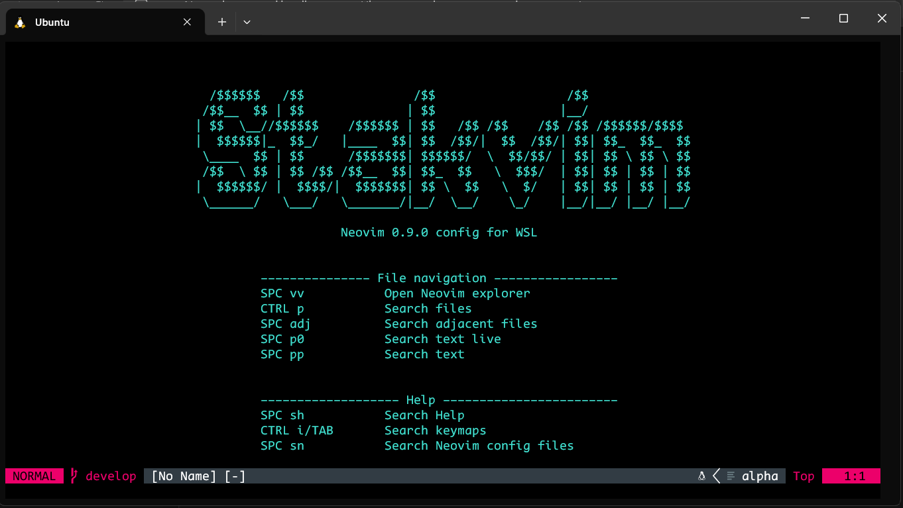
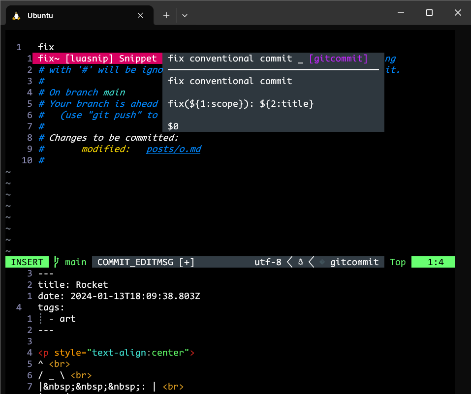

# Pål's Neovim config

## Table of contents

<!-- toc -->

- [Requirements](#requirements)
  * [Semi-requirements / nice to have](#semi-requirements--nice-to-have)
- [Installation](#installation)
  * [Start Neovim](#start-neovim)
- [Usage & utilities](#usage--utilities)
  * [Git](#git)
    + [Source control](#source-control)
      - [Fugitive](#fugitive)
      - [Lazygit.nvim](#lazygitnvim)
  * [Terminal](#terminal)
    + [Exit terminal](#exit-terminal)
    + [Temprorarily jump out of Neovim](#temprorarily-jump-out-of-neovim)
  * [Other tools](#other-tools)
    + [Multiple cursors (Vim visual multi)](#multiple-cursors-vim-visual-multi)
    + [Surround (Nvim surround)](#surround-nvim-surround)
    + [Command preview (live command)](#command-preview-live-command)
  * [Neovim](#neovim)

<!-- tocstop -->

## Requirements

<details>
    <summary>WSL</summary>

This config has been customized for Neovim v0.11.6 on Ubuntu (through WSL on Windows 11)

A note on Windows 11 & its Terminal app:

- `[ctrl] [tab]` is automatically set up to "move to next tab"
- I have _also_ defined a `[ctrl] [tab]` keybinding in the autohotkey file, to "move to previous open tab" (just like hitting `[ctrl] 6` in vim)

If you want to use the latter, you'll have to delete the former. You can open up Terminal settings and delete the "move to next tab".

---
</details>

<details>
    <summary>Neovim version 0.11.6</summary>

**My Neovim info**
````
NVIM v0.9.0
Build type: Release
LuaJIT 2.1.0-beta3
``````

[How to install Neovim 0.11.6 in Ubuntu in WSL](docs/neovim-install.md)

---
</details>

<details>
    <summary>Git > 2.31.0 (For Diffview.nvim)</summary>

**How to update git on Ubuntu**

Check `git --version`

Update if necessary

```bash
sudo add-apt-repository ppa:git-core/ppa -y
sudo apt-get update
sudo apt-get install git -y
git --version
```

---
</details>

<details>
    <summary>fzf > 0.36 (for fzf-lua)</summary>

If this version is not available in your package manager you can use the "git clone" option

https://github.com/junegunn/fzf?tab=readme-ov-file#installation

https://github.com/ibhagwan/fzf-lua?tab=readme-ov-file#dependencies

---
</details>

<!--

<details>
    <summary>Install Ripgrep?</summary>

Ubuntu

```bash
curl -LO https://github.com/BurntSushi/ripgrep/releases/download/14.1.0/ripgrep_14.1.0-1_amd64.deb
sudo dpkg -i ripgrep_14.1.0-1_amd64.deb
```

or...

> If you're an Ubuntu Cosmic (18.10) (or newer) user, ripgrep is available using the same packaging as Debian:
>
>```sh
>sudo apt-get install ripgrep
>```

Other installation methods: <https://github.com/BurntSushi/ripgrep>

---
</details>

-->

<!--

<details>
    <summary>Install C compiler for Nvim-treesitter</summary>

Ubuntu

```bash
sudo apt install build-essential
```

---
</details>

-->


<br>

### Semi-requirements / nice to have

<details>
    <summary>Autohotkey (Windows app, for extra keymaps)</summary>

I have made some additional keymaps using Authotkey.

(Some keymaps are too hard / impossible to define in plain Neovim)

**Install AutoHotkey:**

https://www.autohotkey.com/

Download v2.0, launch `AutoHotkey_2.x.x_setup`, accept the default suggestions

**Start script**

Run ahk file

`:lua Ahk()` (might need to source `:so` `autohotkey/init.lua` first)

or

click 'run script' from the right-click menu on the ahk-file

**Stop script**

`Alt+Esc`

---
</details>

<details>
    <summary>LazyGit (UI for version control)</summary>

Install as explained in <https://github.com/jesseduffield/lazygit#ubuntu>,

run

```bash
LAZYGIT_VERSION=$(curl -s "https://api.github.com/repos/jesseduffield/lazygit/releases/latest" | grep -Po '"tag_name": "v\K[^"]*')
curl -Lo lazygit.tar.gz "https://github.com/jesseduffield/lazygit/releases/latest/download/lazygit_${LAZYGIT_VERSION}_Linux_x86_64.tar.gz"
tar xf lazygit.tar.gz lazygit
sudo install lazygit /usr/local/bin
```

Verify installation

```bash
lazygit --version
```

---
</details>

<details>
    <summary>Git delta (Better git diff)</summary>

visit: <https://dandavison.github.io/delta/installation.html>

Download the deb for Debian / Ubuntu

| Debian / Ubuntu | `sudo dpkg -i git-delta-musl_x.xx.x_amd64.deb` |
| --------------- | ---------------------------------------------- |

**Usage**

`git diff | delta`

see more

<https://www.youtube.com/watch?v=91p1Fp7Db5c>

---
</details>


<details>
    <summary>Emmet-ls (node)</summary>

1. Install node
2. `npm install -g emmet-ls`
3. for jsx code completion

---
</details>

## Installation 

**Clone config**

> [!WARNING]
> If you have something in your ~/.config/nvim folder, create a backup of them first!

```sh
git clone git@github.com:paalss/nvim.git ~/.config/nvim
```



### Start Neovim

In WSL, navigate to the files you want to edit and run:

```bash
nvim
```


