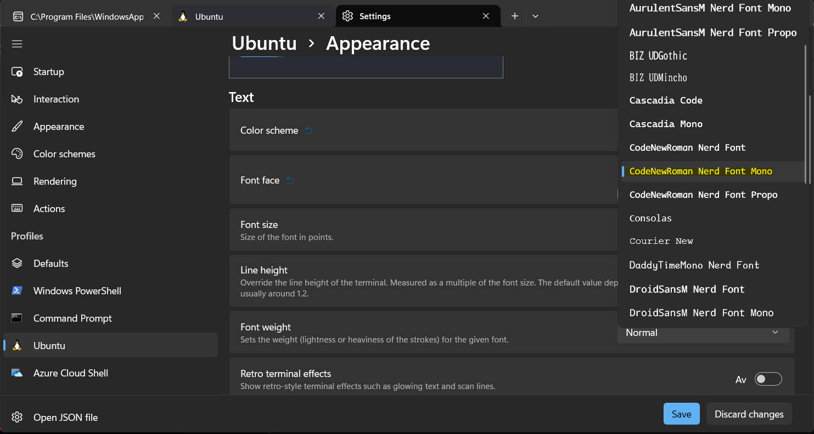

# Neovim 

## Installer

### Ubuntu/WSL

Don't install nvim v0.10.0. Packages such as Telescope doesn't work with that yet.

#### Med Tarball (v0.9.0 Neovim)

Versjon 0.9.0 er ikke tilgjengelig med Apt, så må bruke Tarball metoden for å få 0.9.0. For å installere nyere versjon på linux kan du kjøre tarball metoden.

Last ned tarball, se https://github.com/neovim/neovim/releases/tag/v0.9.0

Flytt til `~/.local/bin/`

```bash
cd ~/.local/bin
tar xzvf nvim-linux64.tar.gz # extract
rm nvim-linux64.tar.gz
ln -s ./nvim-linux64/bin/nvim ./nvim # create symbolic link
```

Følg denne tutorialen, den er steinbra :+1: https://www.youtube.com/watch?v=2wapxsfzLho&list=LL&index=5

### Med Apt (Enklest installasjon, men gir bare v0.4.3 Neovim)

[Skaffe neovim for ubuntu](https://github.com/neovim/neovim/wiki/Installing-Neovim#ubuntu)

```bash
sudo apt install neovim
```

[Dokumentasjon](https://neovim.io/doc/user/)

[Neovim Fireship video](https://www.youtube.com/watch?v=c4OyfL5o7DU)

#### Start

```bash
nvim
```

#### Tutorial

```bash
:Tutor
```

#### Avinstallere

```bash
sudo apt remove neovim
```

#### Åpne Neovim

```bash
nvim
```

### Installer på mac

```bash
brew install neovim
```

## Relatert

### Ta backup av nvim config og clean cache

```bash
mv ~/.config/nvim ~/.config/nvim.bak
```

```bash
mv ~/.local/share/nvim ~/.local/share/nvim.bak
mv ~/.local/state/nvim ~/.local/state/nvim.bak
mv ~/.cache/nvim ~/.cache/nvim.bak
```

https://astronvim.com/

### Install a nerd mono font

Ubuntu nerd font funker for en eller annen grunn ikke. Du får installert den, men den dukker ikke opp i WSL/Ubuntu on windows-menyen. 
Men du kan installere denne: [Meslo](https://github.com/romkatv/dotfiles-public/blob/master/.local/share/fonts/NerdFonts/MesloLGS%20NF%20Regular.ttf) 
eller [3270NerdFont](https://github.com/ryanoasis/nerd-fonts/blob/master/patched-fonts/3270/Regular/3270NerdFont-Regular.ttf) for eksempel

Congratulations!

F.eks.

CodeNewRoman Font Mono



Bruk en mono fixed-width font. Ellers ser det stygt ut.
